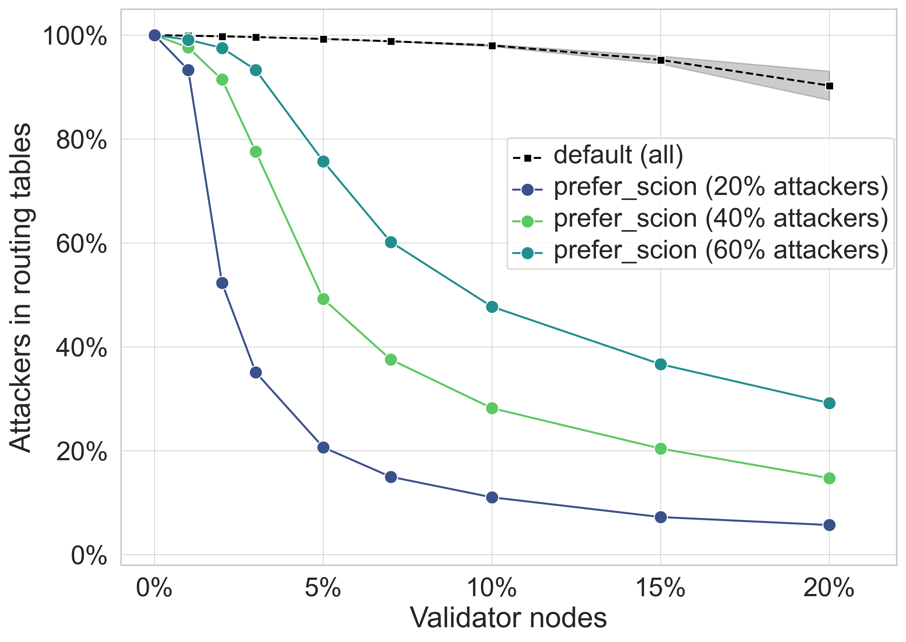

# Detailed Report: Quantifying the Effectiveness of SCION-based Peer Validation against Large-Scale Sybil Attacks

## 1. Introduction and Threat Model
In decentralized peer-to-peer (P2P) systems like the InterPlanetary File System (IPFS), the network relies heavily on Distributed Hash Tables (DHTs) for content and peer discovery. A critical vulnerability in these systems is the **Sybil attack** (or Eclipse attack), where an adversary creates a disproportionately large number of pseudonymous identities. By flooding the network, the attacker attempts to poison the routing tables of honest nodes, severing their connection to the legitimate network and manipulating content retrieval.

While standard IPFS lacks inherent defenses against such network-layer manipulations, the integration of **SCION (Scalability, Control, and Isolation on Next-Generation Networks)** provides a robust trust foundation. SCION raises the cost of Sybil attacks significantly by requiring Autonomous Systems (ASes) to be cryptographically registered within an Isolation Domain (ISD). Coupled with Pervasive Internet-Wide Low-Latency Authentication (PILA), peer identities are tied to verifiable ASes, preventing adversaries from easily forging thousands of authenticated identities. 

This report details a discrete-time event simulation designed to quantitatively evaluate how effectively this SCION-based trust infrastructure can mitigate Sybil attacks when integrated into an IPFS-like Kademlia DHT.

---

## 2. Simulation Methodology and Framework

To evaluate the security impact, we developed a custom discrete-time event simulator modeling an IPFS-like overlay network undergoing a massive Sybil attack.

### 2.1 Network Topology and Scale
The network topology is generated using the **Barabási-Albert (BA) model**, which accurately reflects the emergence of a scale-free, power-law degree distribution characteristic of many real-world P2P systems. The simulation models networks scaling up to **$N = 10,000$ nodes**, with hostile attacker populations ranging from 20% to an extreme 60% of the total network.

### 2.2 Node Roles
Nodes within the network are assigned one of three specific roles:
*   **Honest Peer:** A legitimate network participant that follows the standard DHT protocol correctly.
*   **Attacker Peer (Sybil Node):** A malicious node entirely controlled by an adversary. When queried, attacker nodes exclusively return lists of other known attacker nodes to actively poison honest routing tables.
*   **SCION Validator Peer:** An honest peer that possesses a cryptographically verifiable identity via SCION’s Control-Plane PKI (CP-PKI), allowing other nodes to verify its authenticity.

### 2.3 DHT Abstraction and Lookup Mechanics
The simulation abstracts the k-buckets used in Kademlia-based DHTs (like IPFS) with a bucket size of **$k = 20$**. 
During each simulation step, every honest node performs a routing table refresh:
1. It selects a random peer from its current routing table and performs a lookup.
2. The queried peer returns a list of up to 5 known peers.
3. The querying node must then decide whether to accept or reject these new peers based on its protection status.

### 2.4 Protection Logic and Verification
PILA-based authentication is modeled via a deterministic behavioral rule:
*   **Protected Peers:** An honest peer is considered protected if its routing table contains *at least one* SCION Validator. If a lookup response contains unknown peers, the protected node cross-references this list with its known SCION validator. Using this trusted reference, the node identifies and discards malicious entries.
*   **Unprotected Peers:** A peer with zero SCION validators in its table cannot verify identities and blindly accepts all lookup responses, unknowingly populating its table with adversaries.

### 2.5 Routing Table Update Strategies
The core of the experiment compares two routing table update (eviction) policies when a bucket reaches its capacity of $k=20$:
1.  **Default Strategy (Passive):** Represents standard Kademlia behavior. A newly discovered peer replaces a completely random entry in the full bucket.
2.  **Prefer-SCION Strategy (Active):** Represents a trust-aware overlay. A newly discovered SCION validator is preferentially kept, actively evicting a non-validator peer to make room.

---

## 3. Quantitative Results and Analysis

The primary metric of evaluation is the **Mean Attacker Ratio**, defined as the average percentage of malicious peers present in an honest node's routing table after the simulation converges. The gained results are depicted in the following figure:

### 3.1 The Vulnerability of Passive Deployments (Default Strategy)
The simulation revealed that simply adding SCION validators to the network without modifying the overlay's routing logic yields only marginal security improvements. 
*   Under a severe threat level (60% attackers), deploying **20% SCION validators** while using the `Default` update policy resulted in honest nodes having routing tables that were still **over 90% polluted** by attackers.
*   **Finding:** Without an active retention mechanism, the protective effect of randomly discovered SCION validators is rapidly diluted by standard network churn and aggressive Sybil swarming. The network remains effectively eclipsed.

### 3.2 Dramatic Mitigation via Active Retention (Prefer-SCION Strategy)
Making the DHT protocol explicitly aware of the underlying trust infrastructure drastically alters the security landscape. By utilizing the `Prefer-SCION` strategy, the network exhibits profound resilience.
*   In the identical 60% attacker scenario, utilizing the `Prefer-SCION` strategy alongside a 20% validator deployment slashed the mean attacker ratio down to just **0.29 (29%)**.
*   **Finding:** Actively prioritizing verified nodes ensures that honest peers maintain their "Protected" status over time, effectively neutralizing the adversary's ability to eclipse the network.

### 3.3 The "Critical Mass" Threshold
The simulation demonstrates a clear tipping point. Even under extreme threat levels, the `Prefer-SCION` strategy begins to significantly suppress the attack's impact once a critical mass of **> 10% SCION validators** is deployed. Beyond this threshold, the propagation of malicious routing data is stifled, whereas the passive `Default` strategy offers virtually no protection regardless of validator density.

---

## 4. Architectural Trade-offs and Conclusion

Our findings conclusively demonstrate that integrating SCION provides a robust foundational layer for securing decentralized systems like IPFS. However, its full potential is only realized when the overlay P2P protocol is modified to be aware of—and actively prefer—the underlying trust infrastructure.

**Considerations on Centralization:**
While the `Prefer-SCION` strategy is highly effective at mitigating Sybil attacks, it introduces a trade-off: a centralizing tendency. By heavily prioritizing connections to validator nodes, the network topology shifts slightly toward these trusted entities. 

**Future Outlook:**
This centralizing side-effect is a temporary characteristic of early adoption. As SCION deployment scales and the pool of verifiable, trusted peers expands organically, honest nodes will have access to a vastly wider and more diverse set of validators. Consequently, the centralizing tendency of the `Prefer-SCION` strategy will naturally diminish, yielding a fully decentralized, globally verifiable, and Sybil-resistant P2P network.