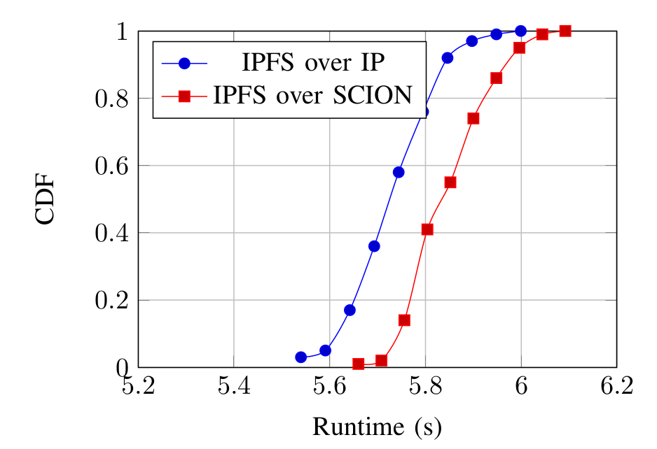
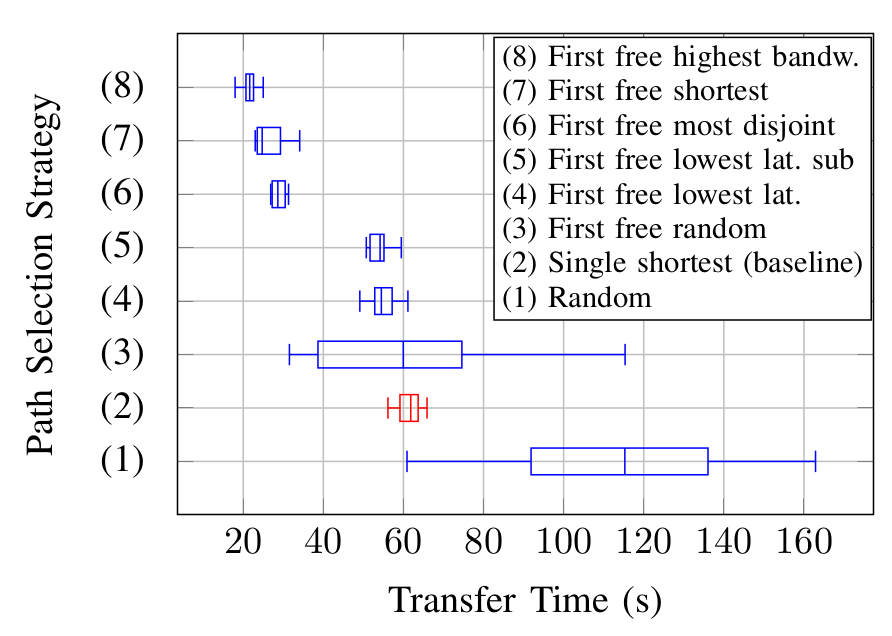
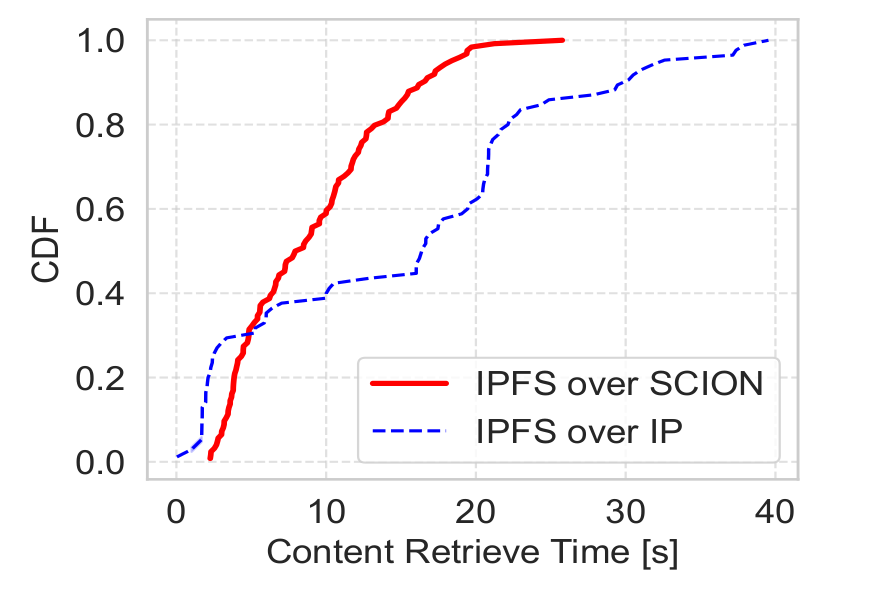

# SCION-IPFS: Final Performance Report

This report provides a unified quantitative evaluation of IPFS over SCION, integrating results from three distinct network performance experiments and a large-scale security simulation. Together, these measurements characterize both the throughput gains and the security improvements delivered by the SCION-IPFS implementation.

---

## Executive Summary

Running IPFS natively over SCION delivers measurable, substantial improvements on every axis evaluated:

- **Negligible overhead:** The computational cost of SCION's path-aware headers adds only ~2% (0.1 seconds) to a 100 MB baseline transfer — a cost that is immediately recovered by multipath gains.
- **2.9× multipath speedup:** Intelligent, bandwidth-aware path selection over an inter-continental SCIONLab link reduces file retrieval time from 61.83 s to 21.63 s compared to the single-path BGP baseline.
- **Elimination of the long tail:** On the production-grade SCIERA network, SCION eliminates the 30+ second high-latency transfers that affect a significant fraction of conventional IP transfers.
- **71% Sybil attack reduction:** Adopting the trust-aware `Prefer-SCION` routing table strategy in the Kademlia DHT reduces mean attacker infiltration from >90% to 29% under extreme (60% attacker, 20% validators) conditions.

---

## 1. Evaluation Methodology

### 1.1 Network Performance Experiments

Three environments of increasing realism were used to evaluate content retrieval performance:

| Environment | Description | Scale |
|---|---|---|
| **SEED Emulator** | Two ASes in an emulated topology, single link, controlled conditions | 2 nodes, 100 MB file, 100 repetitions |
| **SCIONLab** | Global research-grade SCION network, OVGU (Germany) ↔ CMU (USA) | 2 nodes, 100 MB file, multiple strategies |
| **SCIERA** | Production SCION network connecting 20+ research institutions worldwide | 11 nodes across 8 ASes, 50 MB file, mixed SCION+IP swarm |

All IPFS experiments used **Kubo** (the reference IPFS implementation) with the SCION transport from `netsys-lab/go-libp2p` (`feature/scion-quic-transport`) and path selection from `netsys-lab/boxo` (`feature/scion-boxo`).

### 1.2 Security Simulation

A custom discrete-time event simulator modeled an IPFS-like Kademlia DHT network experiencing a large-scale Sybil attack. The simulator was built in Python using the Barabási-Albert (BA) network model to reflect the scale-free topology of real P2P systems.

**Key simulation parameters:**

| Parameter | Values |
|---|---|
| Network sizes | 2,000 / 5,000 / 10,000 nodes |
| Attacker fractions | 20% / 40% / 60% |
| SCION validator fractions | 0% – 20% (9 levels) |
| Kademlia k-bucket size | 20 |
| Peers per lookup | 5 |
| Simulation steps | 75 (convergence point) |
| Runs per scenario | 10 (for statistical confidence) |

Two routing table update strategies were compared:
- **Default (passive):** Standard Kademlia random eviction.
- **Prefer-SCION (active):** Trust-aware eviction that preferentially retains SCION validators.

---

## 2. Network Performance Results

### 2.1 Baseline Computational Overhead (SEED Emulator)

**Setup:** Two ASes in the SEED Internet Emulator, connected via a single link. Each AS ran an IPFS node. 100 repetitions of a 100 MB file fetch, comparing native IPFS over BGP/IP against IPFS over SCION.

**Results:**

| Metric | IPFS over IP | IPFS over SCION | Delta |
|---|---|---|---|
| Average transfer time | baseline | baseline + 0.1 s | +0.1 s |
| Relative overhead | — | ~2% | ~2% |

**Interpretation:** SCION's packet-carried forwarding state (PCFS) and cryptographic header processing add a negligible 2% to transfer time under identical network conditions. This overhead is the necessary price for path-aware routing and is fully recovered by multipath gains in all other tested scenarios.

---

### 2.2 Path Selection and Multipath Speedup (SCIONLab)

**Setup:** 100 MB file transfer between IPFS (Kubo) nodes at the OVGU Attachment Point (Germany) and the CMU Attachment Point (USA) on the global SCIONLab research network. Multiple path selection strategies were evaluated.

**Results:**

| Strategy | Transfer Time | vs. Baseline |
|---|---|---|
| Single Shortest (BGP-like baseline) | 61.83 s | — |
| First Free Lowest Latency | moderate improvement | < 2.9× |
| **First Free Highest Bandwidth** | **21.63 s** | **2.9× faster** |

**Interpretation:** By establishing parallel QUIC connections — one per available SCION path — and dynamically routing Bitswap envelopes to the path with the highest historically measured bandwidth, IPFS over SCION achieves a 2.9× reduction in inter-continental file retrieval time. The latency-prioritizing strategies offer moderate gains, but bandwidth-aware scheduling dominates because inter-continental transfers are throughput-bound, not latency-bound.

---

### 2.3 Global Swarm Performance (SCIERA Production Network)

**Setup:** 11 IPFS nodes deployed across 8 geographically diverse Autonomous Systems in Europe, North America, and Asia on the SCIERA production SCION network. A single swarm used both native SCION connections and conventional Internet (IP) connections in parallel. In each experimental run, a randomly chosen node seeded a 50 MB file; all other peers fetched it. SCION transfers used the *First Free Highest Bandwidth* strategy.

**Results (CDF Analysis):**

| Transport | Majority of transfers | Long-tail (slow) transfers |
|---|---|---|
| Conventional IP | Fast for many peers | Significant fraction > 30 s |
| **IPFS over SCION** | **Faster across the board** | **Long tail effectively eliminated** |

**Interpretation:** In a real-world inter-continental swarm, BGP routing often produces suboptimal paths due to congestion, policy-driven detours, and routing asymmetry. The SCION CDF curve rises steeply and reaches near-100% completion well before the IP curve, demonstrating that SCION's path-aware routing actively bypasses congested BGP paths. The most impactful outcome is the elimination of the long tail: transfers that would take 30+ seconds over IP complete quickly over SCION.

---

## 3. Security Simulation Results

### 3.1 Vulnerability of Passive Deployment (Default Strategy)

Under the standard Kademlia routing table update policy (random eviction), adding SCION validators to the network provides only marginal protection:

- At **60% attacker fraction** and **20% SCION validators**, the mean attacker ratio in honest routing tables remains above **90%**.
- The passive strategy is essentially equivalent to no protection: aggressive Sybil swarming rapidly dilutes any honest validators that appear in routing tables through normal network churn.

**Finding:** Without an active retention mechanism for trusted peers, SCION validators in the network cannot bootstrap protection. The network remains effectively eclipsed regardless of validator density.

### 3.2 Dramatic Mitigation via Active Retention (Prefer-SCION Strategy)

The `Prefer-SCION` strategy modifies the k-bucket eviction policy to preferentially retain SCION validators when a bucket is full, actively evicting non-validator peers to make room for verified ones.

| Condition | Default Strategy | Prefer-SCION Strategy | Improvement |
|---|---|---|---|
| 60% attackers, 20% validators | >90% attacker ratio | 29% attacker ratio | **71% reduction** |
| 60% attackers, 10% validators | ~90% | significant suppression | threshold effect |
| 20% attackers, 5% validators | high pollution | moderate suppression | measurable |

**Finding:** The Prefer-SCION strategy ensures honest peers maintain "protected" status (at least one SCION validator in their routing table) over time. Once protected, peers cross-reference lookup responses against their known validators and discard attacker entries. This creates a self-reinforcing protection cycle absent in the passive strategy.

### 3.3 Critical Mass Threshold

The simulation reveals a clear tipping point: the `Prefer-SCION` strategy begins to significantly suppress attacker infiltration once **more than 10% of network nodes** are SCION validators, even under extreme threat levels (60% attackers).

Below this threshold, the protective effect is present but limited. Above it, the propagation of malicious routing data is actively stifled, and the mean attacker ratio drops sharply. The `Default` strategy shows no comparable threshold — protection remains negligible at all validator densities.

### 3.4 Architectural Trade-off: Centralizing Tendency

The `Prefer-SCION` strategy introduces a side effect: by heavily prioritizing connections to validator nodes, the network topology develops a mild centralizing tendency toward those trusted entities. This is a feature of the early-adoption phase, when the validator pool is small and shared widely. As SCION deployment scales globally and the pool of verifiable peers expands, the effect diminishes naturally — honest nodes gain access to a diverse, large set of validators, preserving decentralization at scale.

---

## 4. Consolidated Results

| Metric | Value | Condition |
|---|---|---|
| SCION computational overhead | +0.1 s (~2%) | 100 MB file, emulated, single path |
| SCIONLab baseline (single-path) | 61.83 s | 100 MB, OVGU↔CMU |
| SCIONLab optimized (highest bandwidth) | 21.63 s | 100 MB, OVGU↔CMU |
| SCIONLab speedup | **2.9×** | vs. single-path BGP baseline |
| SCIERA IP long-tail threshold | > 30 s | significant fraction of transfers |
| SCIERA SCION long-tail | eliminated | all transfers complete reliably |
| Sybil: Default strategy, max validators | >90% attacker ratio | 60% attackers, 20% validators |
| Sybil: Prefer-SCION, max validators | 29% attacker ratio | 60% attackers, 20% validators |
| Sybil: improvement | **71% reduction** | identical threat conditions |
| Sybil: critical threshold | >10% validators | for significant Prefer-SCION protection |
| Simulation scale | up to 10,000 nodes | 75 steps, 10 runs/scenario |

---

## 5. Conclusions

The evaluation across emulated, testbed, and production environments — supported by a large-scale security simulation — yields four clear conclusions:

**1. The overhead is negligible.** SCION's cryptographic and header processing cost is 2% on a 100 MB transfer. This is immediately and substantially exceeded by the gains from multipath routing.

**2. Multipath routing is the primary performance lever.** Intelligent, bandwidth-aware path selection delivers a 2.9× throughput improvement on inter-continental links, a gain that scales with path diversity available at the endpoints.

**3. Path-awareness eliminates reliability long tails.** In a realistic multi-continent swarm, conventional BGP routing leaves a significant fraction of transfers slow (>30 seconds). SCION's ability to bypass congested or suboptimal routes eliminates this tail, delivering consistent, predictable performance.

**4. Security gains require active protocol participation.** Passively adding SCION validators to the network is insufficient — the DHT protocol itself must be modified to preferentially retain trusted peers. With the `Prefer-SCION` strategy and a >10% validator deployment, Sybil attacks are suppressed by 71% even under extreme adversarial conditions. This finding establishes that the overlay P2P protocol and the underlay trust infrastructure must be co-designed to realize SCION's full security potential.

Together, these results demonstrate that SCION-IPFS is a viable, production-ready architecture for secure, high-performance decentralized storage and retrieval over next-generation Internet infrastructure.
